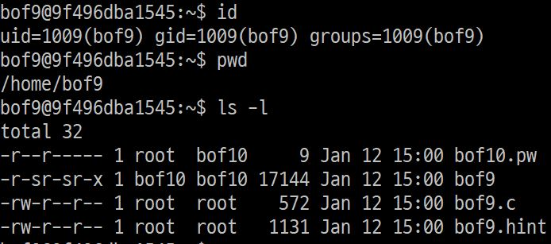
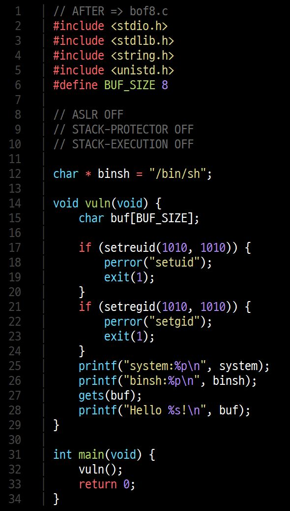

# bof9 풀이

## 개요

현재 bof9의 id로 접속한 상태이고, bof10의 권한을 얻고싶은 상황이다.

  
bof9로 home directory를 보면 <code>bof9</code>, <code>bof9.c</code> 파일과 bof10의 비밀번호가 있는 <code>bof10.pw</code> 파일이 있다.  
bof10의 비밀번호는 <code>bof10</code>파일에 저장되어 있다. 그러나, <code>bof10.pw</code>를 읽기 위해서는 bof10의 권한이 필요한데, 마침 <code>bof9</code>파일이 bof10권한으로 실행되므로 이 프로그램을 이용해보도록 하자.

## 소스코드
 bof9.c 코드  
코드를 분석해보면 <code>vuln()</code> 함수로 들어가 <code>system</code> 의 주소와 <code>"/bin/sh"</code>가 저장되어 있는 <code>binsh</code>을 출력하고  
<code>gets</code>로 입력을 받아 <code>buf</code>에 저장하고 <code>buf</code>의 내용을 출력한다.  

이 때 <code>vuln</code>함수로 들어간다는 점을 이용해 stack에 저장되어 있는 return할 주소를 <code>/bin/sh</code>가 적혀있는 주소로 바꿔주면 bof10권한으로 쉘을 실행시킬 수 있을 것 같다. <code>gets</code>함수의 overflow로 return 주소를 바꿔보자.

## buf와 return address 사이의 거리  
gdb를 이용해 buf와 return address가 저장된 곳의 거리를 구해보도록 하자  

1. return address 저장 주소  
 stack에 저장된 return 주소  
 $rsp 값  
<code>vuln</code>함수에 들어오면 가장 먼저 return address를 stack에 저장한다. 이 값은 $rsp에 저장되어 있으므로 $rsp의 값을 읽었다.

2. buf 주소  
  
  
buf의 주소는 아래에서 <code>gets</code>에서 <code>buf</code>의 주소를 사용하므로, 이 때 $rdi를 보면 알 수 있다.  

3. buf - innocent 사이의 거리  
    - return address가 저장된 주소 0x7fffffffe498  
    - buf 주소 0x7fffffffe488  

    둘의 차이를 계산해보면 16byte 차이가 난다.  

## return address 조작하기?  
우리가 이제 해야할 일은 return address를 조작하는 것이다.  
그런데, 이전과는 다르게 이 파일은 다음과 같이 stack에서는 'execution'권한이 없다.  
  
이럴 경우에는 실행권한이 있는 곳으로 우회해야 하는데,  
  
libc 라이브러리에는 실행권한이 있으니 libc의 <code>system</code>함수에 <code>"/bin/sh"</code>이 적혀있는 주소를 argument로 주면 쉘을 실행할 수 있을 것이다.  
  
<code>"/bin/sh"</code>의 주소는 위처럼 gdb에서 찾을 수 있다.

## payload 만들기
1. <code>system</code> 함수 주소  
<code>system</code> 함수는 gdb를 이용해 간단하게 구할 수 있다.  

2. <code>system</code> 에 argument 넣기  
<code>system</code> 함수는 <code>$rdi</code>의 값을 argument로 받는다. 그렇다면 <code>$rdi</code>에 <code>"/bin/sh"</code>을 넣으면 되는데, 이 과정은 libc에서 <code>pop rdi ; ret</code> 명령이 기계어로 저장되어 있는 부분을 실행하고 pop할 곳을 <code>"/bin/sh"</code>의 주소로 넣어주면 <code>$rdi</code>에 들어갈 것이다.  
  
libc는 위에서 찾은 것처럼 <code>/tmp/2.23/lib/libc.so.6</code>에 있고, 가젯을 찾는 <code>ROPgadget.py</code> 프로그램을 이용해 <code>pop rdi ; ret</code>의 가젯의 주소를 찾았다. 위의 것들 중 정확하게 일치하는 <code>0x21102</code>일 것이다. 이는 libc.so.6에서의 offset 주소이므로, libc.so.6의 주소에 해당 주소를 더해주면 실행했을 때의 주소가 나올 것이다.  
따라서 $$0x7ffff7a0d000 + 0x21102 = 0x7ffff7a2e102$$ 이다.  

3. payload 구조  
최종적으로 만든 payload의 구조는 다음과 같다.  

    || 쓰레기값 | return 주소 | "/bin/sh" 주소 | system 함수 주소|
    |:---:|:---:|:---:|:---:|:---:|
    |의미| 없음 | pop rdi ; ret | "/bin/sh" | system() |
    |값|x|0x7ffff7a2e102|0x7ffff7b99d57|0x7ffff7a52390|
    | 크기 | 16byte | 8byte | 8byte | 8byte |

    위처럼 해주면 <code>vuln</code>함수가 끝나 return 할 때 <code>pop rdi ; ret</code>를 실행하는 주소로 return되어 <code>pop rdi</code>와 <code>ret</code>을 실행하여 뒤에 over flow로 들어간 <code>"/bin/sh"</code>가 <code>$rdi</code>로 들어가고, <code>ret</code>에 의해 <code>system</code>이 call 되어 최종적으로 <code>system("/bin/sh")</code>이 실행된다.  

## 성공
  
위처럼 payload를 넘겨주어 bof10의 권한을 탈취하는데 성공했다!